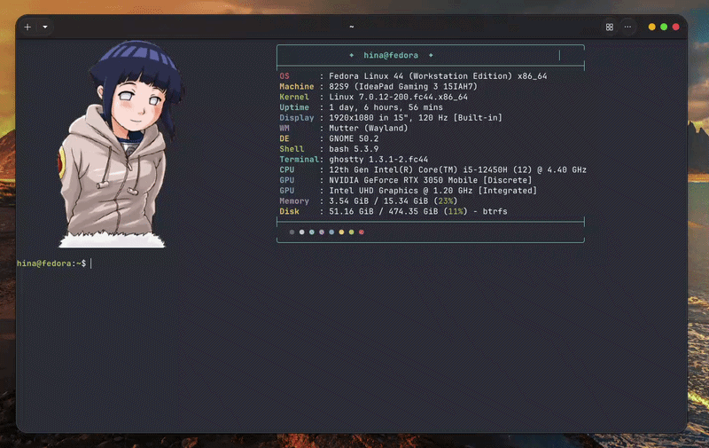

<h1 align="center">🎵 GDrive-Music</h1>
> Stream your Google Drive music from the terminal — rclone + MPD + rmpc + cava


Stream your entire music library from Google Drive with album art, lyrics,
and a spectrum visualizer — using less than 50 MB RAM.

```
Google Drive (your music, any size)
  └─ rclone  →  MPD  →  rmpc (TUI + album art + lyrics + visualizer)
```
## 🎬 Demo

<p align="center">
  
</p>

---

## ⭐ Star History

[](https://star-history.com/#Venkatesh-6921/gdrive-music&Date)

---

## 🙋 Why I Built This

I had 1 TB of music sitting on Google Drive and a laptop with a small SSD.
Every music player I found either needed local files or a paid subscription.

I wanted something that:
- Streams directly from Google Drive with no local storage
- Looks like those YouTube Linux rice setups (album art, visualizer, vim keys)
- Is 100% free and open source
- Works with a single setup command

So I built it. rclone mounts the Drive. MPD plays the audio. rmpc is the TUI.
cava draws the visualizer. All of it stitched together with one setup wizard.

---

## ⚠️ Terminal Requirement

Album art requires a **Kitty-protocol compatible terminal.**

| Terminal | Album Art | Notes |
|----------|-----------|-------|
| **Ghostty** | ✅ | ⭐ Recommended |
| **Kitty** | ✅ | ⭐ Recommended |
| **WezTerm** | ✅ | ✅ Works |
| **foot** | ✅ (sixel) | ✅ Works |
| GNOME Terminal | ❌ | Music works, no art |
| Alacritty | ❌ | Music works, no art |
| VS Code terminal | ❌ | Not recommended |

Install Ghostty: https://ghostty.org

---

## 🐧 Supported Distros

| Distro | Script | Status |
|--------|--------|--------|
| **Fedora** 40+ | `scripts/setup.sh` | ✅ Tested |
| **Ubuntu** 20.04+ · Mint · Pop!_OS · Zorin | `scripts/setup-ubuntu.sh` | ⚠️ Untested — should work |
| **Debian** 11+ | `scripts/setup-debian.sh` | ⚠️ Untested — should work |
| **Arch** · Manjaro · EndeavourOS | `scripts/setup-arch.sh` | ⚠️ Untested — should work |

> **Only Fedora 44 has been tested by the developer.**
>
> The Ubuntu, Debian, and Arch scripts are included but have not been run on
> a real machine yet. They follow the same logic as the Fedora script with
> distro-specific package managers and fixes applied — but bugs are possible.
>
> **If you're on Ubuntu, Debian, or Arch:**
> - Try running the script for your distro
> - If it works → [open an issue](https://github.com/Venkatesh-6921/gdrive-music/issues/new) titled `✅ Tested on [your distro]` and let us know
> - If it breaks → [open an issue](https://github.com/Venkatesh-6921/gdrive-music/issues/new) with the error and your distro version
>
> Your reports are how these scripts get confirmed and improved.

---

## 🚀 Install

```bash
git clone https://github.com/Venkatesh-6921/gdrive-music
cd gdrive-music

# Pick your distro:
bash scripts/setup.sh           # Fedora
bash scripts/setup-ubuntu.sh    # Ubuntu / Mint / Pop!_OS / Zorin
bash scripts/setup-debian.sh    # Debian
bash scripts/setup-arch.sh      # Arch / Manjaro
```

The wizard handles everything — packages, Google Drive auth, MPD, rmpc config,
and first library scan. Takes about 10 minutes + Google login.

---

## 🎮 Usage

```bash
music              # launch rmpc player
music --cava       # launch rmpc + open cava in a new window
mpd-update         # rescan Google Drive for new songs (live progress bar)
music-status       # check if services are running
music-cache        # see SSD cache usage (max 500 MB)
music-clear-cache  # free the SSD cache
```

---

## ⌨️ Keyboard Controls

### Playback

| Key | Action |
|-----|--------|
| `p` | Play / Pause |
| `>` / `<` | Next / Previous track |
| `f` / `b` | Seek forward / back |
| `.` / `,` | Volume up / down |
| `r` | Toggle repeat |
| `z` | Toggle shuffle |

### Tabs

| Key | Action |
|-----|--------|
| `1` | Queue |
| `2` | Directories (browse Drive) |
| `3` | Artists |
| `4` | Albums |
| `5` | Playlists |
| `6` or `F` | Search |
| `Tab` | Next tab |

### Navigation

| Key | Action |
|-----|--------|
| `j` / `k` | Down / Up |
| `h` / `l` | Left / Right |
| `g` / `G` | Top / Bottom |
| `Enter` | Play / confirm |
| `a` | Add to queue |
| `d` | Remove |
| `/` | Search current list |
| `Esc` | Back / close |
| `I` | Song info |
| `q` | Quit rmpc (music keeps playing) |
| `?` | Show all keybindings |

---

## ⚙️ How It Works

rclone mounts your Google Drive as a local folder with a 500 MB SSD cache.
MPD reads that folder and handles audio via PipeWire or PulseAudio.
rmpc is a Rust TUI with album art, synced lyrics, and a built-in visualizer.

**SSD cache:** only the current song is cached while playing. After 1 hour
idle the cache auto-deletes. 500 MB is a ceiling, not a permanent reservation.

---

## 💡 Tips

- Organize Drive as `Artist / Album / song.mp3` for best library browsing
- After adding music to Drive, run `mpd-update` to rescan
- Token expires after 90 days idle: `rclone config reconnect gdrive:`
- Set system media keys in Settings → Keyboard → Custom Shortcuts:
  - Play/Pause → `mpc toggle`
  - Next → `mpc next`
  - Previous → `mpc prev`

---

## 🔧 Troubleshooting

See [TROUBLESHOOTING.md](TROUBLESHOOTING.md) for the full guide.

**Quick checks:**
```bash
systemctl --user status rclone-gdrive   # is Drive mounted?
systemctl --user status mpd             # is MPD running?
ls ~/Music/gdrive                       # can you see your files?
mpc stats                               # how many songs indexed?
```

---

## 🗑️ Uninstall

```bash
bash scripts/uninstall.sh
```

Removes everything — binaries, configs, services, aliases, cache.

---

## 🧪 Tested On

- **Fedora 44** ✅ — developer machine (Venkatesh-6921)

Running on a different distro?
[Open an issue](https://github.com/Venkatesh-6921/gdrive-music/issues) and tell
us what distro, what happened, and we'll fix it.

---

## 🗺️ Roadmap

These are planned for future releases. Not promises — priorities.

- [ ] **Friendly disconnect/retry** — show `Google Drive unavailable. Retrying in 10s...` instead of service crashes
- [ ] **Incremental library scan** — only rescan changed folders, not the whole Drive
- [ ] **Multi-cloud support** — Dropbox, OneDrive, S3, Nextcloud (rclone already supports them)
- [ ] **Shareable config** — `gdrive-music export-config` / `import-config`
- [ ] **macOS support**
- [ ] **Local listening history** — track plays locally, generate smart playlists
- [ ] **Last.fm scrobbling** — via MPD's built-in scrobbler plugin

> Have a feature idea? [Open a feature request](https://github.com/Venkatesh-6921/gdrive-music/issues/new)

---

## 📦 Stack

| Tool | Role | License |
|------|------|---------|
| [rclone](https://rclone.org) | Google Drive mount | MIT |
| [MPD](https://www.musicpd.org) | Music playback daemon | GPL-2.0 |
| [rmpc](https://github.com/mierak/rmpc) | Terminal UI | MIT |
| [cava](https://github.com/karlstav/cava) | Spectrum visualizer | MIT |

---

## 📝 Changelog

### v1.0.0 — 2026-06-15
- 🎉 Initial release
- ✅ Fedora 40+ fully tested and working
- 🐧 Ubuntu, Debian, Arch setup scripts included (community testing welcome)
- 🎨 rmpc configured with album art, synced lyrics, built-in visualizer
- ⌨️ Full vim-style keybinds (j/k navigation, tab switching, search)
- 🔄 Auto-mount Google Drive on login via systemd user service
- 📊 Live library scan progress bar (`mpd-update`)
- 🎵 `music` and `music --cava` shell commands
- 🗑️ Clean uninstall script
- 🔊 Auto-detects PipeWire vs PulseAudio

---

## 🤝 Contributing

Read [CONTRIBUTING.md](CONTRIBUTING.md) before opening a PR.

In short: fork → change → raise a PR. Do not request direct repo access.
All PRs are reviewed and merged by the project maintainer only.

---

## 📜 Code of Conduct

This project follows the [Contributor Covenant](CODE_OF_CONDUCT.md).
Be respectful. Focus on the project.

---

## License

MIT — do whatever you want with it.

---

*Built by [Venkatesh-6921](https://github.com/Venkatesh-6921) — Visakhapatnam, India*
